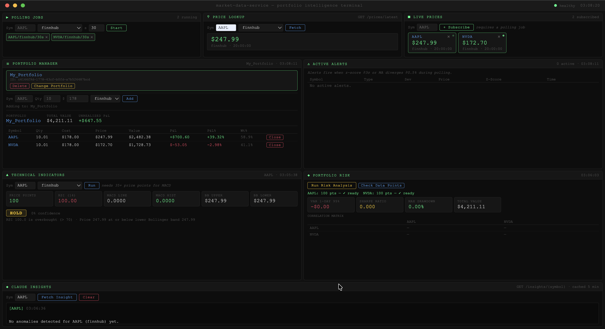

# Market Data Service — Portfolio Intelligence Platform

> Real-time financial data pipeline using Kafka streaming and FastAPI, with PostgreSQL table partitioning and Redis caching, processing 100K+ events/min at sub-200ms latency while cutting database load by 75%.
>
> Extended into a full **Portfolio Intelligence Platform** with technical analysis, risk metrics (VaR, Sharpe), WebSocket streaming, and Claude-powered natural language portfolio Q&A.

---

## Prerequisites

- **Docker** (version 20.0 or higher)
- **Docker Compose** (version 2.0 or higher)

## Quick Start

```bash
git clone https://github.com/JukaleManmath/market-data-service.git
cd market-data-service
cp .env.example .env   # fill in your API keys and DB credentials
docker compose -f docker/docker-compose.yml --env-file .env up --build
```

This will build all images, start all containers, and apply database migrations automatically.

> **Note:** The `--env-file .env` flag is required because the compose file lives in `docker/` — without it, Docker Compose won't find the `.env` at the project root.

## Dashboard



## Service Access Points

| Service | URL | Purpose |
|---------|-----|---------|
| API + Swagger | http://localhost:8000/docs | REST API + interactive docs |
| Terminal Dashboard | http://localhost:8000/ui | Browser dashboard covering all routes |
| Database Admin | http://localhost:8080 | Adminer (PostgreSQL UI) |
| PostgreSQL | localhost:5433 | Direct DB access |
| Redis | localhost:6379 | Cache |
| Kafka | localhost:9092 | Message broker |

## Development Commands

```bash
# Start detached
docker compose -f docker/docker-compose.yml --env-file .env up -d

# View logs
docker compose -f docker/docker-compose.yml logs -f marketdata-api
docker compose -f docker/docker-compose.yml logs -f ma-consumer

# Stop
docker compose -f docker/docker-compose.yml down

# Stop + wipe volumes (clean slate)
docker compose -f docker/docker-compose.yml down -v

# Run migrations manually
docker exec -it marketdata-api alembic upgrade head

# Test price fetch
curl "http://localhost:8000/prices/latest?symbol=AAPL&provider=finnhub"

# Create a polling job
curl -X POST http://localhost:8000/prices/poll \
  -H "Content-Type: application/json" \
  -d '{"symbols": ["AAPL", "NVDA"], "interval": 30, "provider": "finnhub"}'
```

---

## Architecture

```
┌──────────────────────────────────────────────────────────────────┐
│                            Clients                               │
│        REST API    WebSocket (/ws/prices/{symbol})    /ui        │
└──────┬──────────────────┬─────────────────────────────┬──────────┘
       │                  │                             │
┌──────▼──────────────────▼─────────────────────────────▼──────────┐
│                      FastAPI (Port 8000)                          │
│           Request ID Middleware → JSON Logger                     │
│                                                                   │
│   /prices  /portfolios  /analytics  /insights  /alerts  /health  │
└──────┬────────────────────────────────────────────────────────────┘
       │
       ├──────────────────┐
       ▼                  ▼
┌─────────────┐    ┌─────────────┐
│    Redis    │    │ PostgreSQL  │
│   cache     │    │ partitioned │
│             │    │  by month   │
└─────────────┘    └─────────────┘
                          ▲
┌─────────────────────────┼──────────────────────────┐
│              Kafka Topics                           │
│  price-events (6p)   anomaly-events (3p)           │
│  portfolio-events (3p)                             │
└──────┬──────────────────┬─────────────────────────┘
       │                  │
       ▼                  ▼
┌─────────────┐    ┌─────────────────┐    ┌───────────────────┐
│ MA Consumer │    │ Anomaly Consumer│    │ Kafka Broadcaster │
│ (5-pt MA)   │    │ (z-score +      │    │ → WebSocket push  │
│             │    │  MA crossover)  │    │                   │
└─────────────┘    └────────┬────────┘    └───────────────────┘
                            │
                            ▼
                   ┌─────────────────┐
                   │   Claude API    │
                   │ portfolio Q&A,  │
                   │ regime detect,  │
                   │ anomaly explain │
                   └─────────────────┘
```

---

## Full API Reference

| Method | Endpoint | Description |
|--------|----------|-------------|
| GET | `/prices/latest` | Fetch current price (Redis → DB → API) |
| POST | `/prices/poll` | Create periodic polling job |
| DELETE | `/prices/poll/{job_id}` | Stop and delete a polling job |
| GET | `/health` | PostgreSQL + Redis health check |
| GET | `/alerts/active` | Active anomaly alerts (symbol/provider optional) |
| POST | `/alerts/{id}/resolve` | Resolve an alert |
| GET | `/insights/{symbol}` | Claude summary for one symbol (cached 5 min) |
| POST | `/portfolios` | Create portfolio |
| DELETE | `/portfolios/{id}` | Delete portfolio and all its positions |
| GET | `/portfolios/{id}/snapshot` | Live P&L snapshot (uses Redis prices) |
| POST | `/portfolios/{id}/positions` | Add/update position (weighted avg cost basis) |
| DELETE | `/portfolios/{id}/positions/{pos_id}` | Close a position |
| GET | `/portfolios/{id}/analysis` | Claude full portfolio analysis (cached 5 min) |
| POST | `/portfolios/{id}/ask` | Natural language Q&A via Claude tool use (cached 2 min) |
| GET | `/analytics/{symbol}/indicators` | RSI, MACD, Bollinger Bands + BUY/SELL/HOLD signal |
| GET | `/analytics/portfolios/{id}/risk` | VaR, Sharpe, max drawdown, correlation matrix |
| WS | `/ws/prices/{symbol}` | Real-time price stream (WebSocket) |
| GET | `/ui` | Terminal dashboard (StaticFiles) |

---

## Build Plan

### Phase 1 — Bug Fixes + OOP/SOLID Refactor ✅

**Goal:** Correct running service with clean, extensible architecture.

**Bugs fixed:**

| File | Fix |
|------|-----|
| `app/kafka/consumer.py` | Wrapped module-level code into `start_consumer()`. Replaced hardcoded `'kafka:9092'` with `settings.kafka_bootstrap_servers`. |
| `app/services/polling_worker_service.py` | Fixed `timestamp=datetime.fromisoformat(data["timestamp"])`. Removed duplicate `PricePoint` write. |
| `app/services/price_service.py` | Fixed duplicate `RawMarketData` write — `_persist()` always writes both records atomically. |

**Refactor applied (SOLID):**

| New file | Purpose |
|----------|---------|
| `app/services/providers/base.py` | `BaseProvider` ABC + `PriceFetchResult` dataclass |
| `app/services/providers/finnhub.py` | `FinnhubProvider(BaseProvider)` |
| `app/services/providers/alpha_vantage.py` | `AlphaVantageProvider(BaseProvider)` |
| `app/services/providers/registry.py` | `get_provider(name)` — only place that changes when adding a provider |
| `app/services/price_service.py` | 3-tier fetch orchestrator with injected dependencies |
| `app/services/moving_average_service.py` | MA computation, fully decoupled from Kafka |

```bash
# Verify
curl "http://localhost:8000/prices/latest?symbol=AAPL&provider=finnhub"
docker compose -f docker/docker-compose.yml logs ma-consumer | grep "MA Consumer started"
```

---

### Phase 2 — Performance & Partitioning ✅

**Goal:** PostgreSQL table partitioning, async SQLAlchemy, async Redis, Kafka reliability tuning.

**2a — PostgreSQL Partitioning** (`alembic-migrations/versions/b1c3e5f7a9d2_partition_price_points_by_month.py`):
- Drop flat `price_points` (no historical data to migrate)
- Recreate as `PARTITION BY RANGE (timestamp)` with composite PK `(id, timestamp)`
- Create monthly child partitions 2026-03 through 2027-12 + catch-all `price_points_future`
- Add `idx_price_points_symbol_ts (symbol, timestamp DESC)` on the parent

**2b — Async SQLAlchemy** (`app/database/session.py`):
- Add `create_async_engine` + `AsyncSessionLocal` + `get_async_db()` alongside the existing sync session
- Sync `SessionLocal` kept — MA consumer uses confluent_kafka which is blocking

**2c — Async Redis** (`app/core/redis.py`):
- Swap `redis.Redis` → `redis.asyncio.Redis`

**2d — Kafka tuning** (`app/kafka/producer.py`):
- Add `acks="all"` and `retries=5` — no silent message loss on transient failures
- Remove per-message `producer.flush()` — was blocking the event loop; flush once on shutdown

```bash
# Verify partitioning
docker exec postgres psql -U postgres -d marketdata -c "\d+ price_points"
# → Partition key: RANGE (timestamp), 23 child tables listed
```

---

### Phase 3 — Anomaly Detection + Claude Symbol Insights ✅

**Goal:** Z-score and MA crossover anomaly detection → alerts table → Claude narrative per symbol.

| File | Purpose |
|------|---------|
| `app/models/alerts.py` | `AlertSeverity` (low/medium/high), `AnomalyType` (zscore_spike/drop/ma_crossover) |
| `app/services/anomaly_detector.py` | Z-score (threshold 2.5, 20-pt lookback) + MA crossover |
| `app/services/ai_insights.py` | `claude-sonnet-4-6` — builds prompt from prices + MAs + alerts, cached 5 min |
| `app/kafka/anomaly_consumer.py` | Reads `price-events`, detects anomalies, writes to `anomaly-events` + DB |
| `app/api/insights.py` | `GET /insights/{symbol}` |
| `app/api/alerts.py` | `GET /alerts/active`, `POST /alerts/{id}/resolve` |

```bash
curl "http://localhost:8000/alerts/active?symbol=AAPL"
curl "http://localhost:8000/insights/AAPL"
# → Claude summary cached in Redis, alert rows in DB
```

---

### Phase 4 — Observability ✅

| File | Purpose |
|------|---------|
| `app/core/logging.py` | `JSONFormatter` + `setup_logging()` — structured `{timestamp, level, request_id, message}` |
| `app/middleware/request_id.py` | UUID per request, propagated as `X-Request-ID` response header |
| `app/api/health.py` | `GET /health` — `SELECT 1` + Redis `PING` → `{status, checks}` |

```bash
curl http://localhost:8000/health
# → {"status": "ok", "checks": {"postgres": "ok", "redis": "ok"}}
```

---

### Phase 5 — Portfolio Management Layer ✅

**Goal:** Users define holdings, track live P&L, see position weights.

New models (`alembic-migrations/versions/e5f6a7b8c9d0_add_portfolio_tables.py`):
- `Portfolio` — id, name, created_at
- `Position` — id, portfolio_id, symbol, provider, quantity, avg_cost_basis, opened_at, closed_at, is_active

**`app/services/portfolio_service.py`**:
- `get_snapshot()` — fetches current prices from Redis (falls back to DB), computes market_value, unrealized_pnl, pnl_pct, weight per position
- `add_or_update_position()` — weighted average cost basis on each buy
- `close_position()` — marks position inactive, sets closed_at

```bash
curl -X POST http://localhost:8000/portfolios \
  -H "Content-Type: application/json" -d '{"name":"Tech Portfolio"}'

curl -X POST "http://localhost:8000/portfolios/{id}/positions" \
  -H "Content-Type: application/json" -d '{"symbol":"AAPL","quantity":100,"price":175.00}'

curl "http://localhost:8000/portfolios/{id}/snapshot"
# → {portfolio_id, portfolio_name, total_value, total_pnl, positions: [{symbol, current_price, unrealized_pnl, pnl_pct, weight}]}
```

---

### Phase 6 — Technical Analysis & Risk Metrics ✅

**Goal:** Full indicator suite (RSI, MACD, Bollinger Bands) + portfolio-level risk (VaR, Sharpe, correlation matrix).

| File | Purpose |
|------|---------|
| `app/services/technical_analysis.py` | RSI (14-period), MACD (12/26/9 EMA), Bollinger Bands (20-period, 2σ) |
| `app/services/signal_generator.py` | Rule-based voting → BUY/SELL/HOLD + confidence score + reasons list |
| `app/services/risk_engine.py` | Parametric VaR (95%), Sharpe (annualised), max drawdown, correlation matrix |
| `app/api/analytics.py` | Two endpoints wired to the services above |
| `app/schemas/analytics.py` | `IndicatorResponse`, `RiskResponse` |

| Indicator | Lookback | Notes |
|-----------|----------|-------|
| RSI | 14 periods | RS = avg_gain/avg_loss |
| MACD | 12/26/9 EMA | Line, signal, histogram |
| Bollinger Bands | 20 periods, 2σ | Upper, middle, lower band |

> All indicators use close price only (no OHLCV). Indicators return `null` when insufficient history exists — minimum 15 for RSI, 20 for Bollinger, 35 for MACD.

**`app/services/risk_engine.py`** — numpy + scipy:
```
1. Fetch price series per active position (up to 252 points)
2. Compute daily log returns per symbol
3. Build covariance matrix
4. Portfolio variance = w.T @ cov_matrix @ w
5. Parametric VaR = portfolio_value * z_score * sqrt(variance)   [95% confidence]
6. Sharpe = (mean_return - risk_free_rate) / std_return * sqrt(252)
7. Max drawdown = worst (peak - trough) / peak over full history
8. Correlation matrix — np.corrcoef, handles single-symbol edge case
```

**`app/services/signal_generator.py`** — rule-based voting:
- RSI < 30 → +1 BUY, RSI > 70 → +1 SELL
- MACD histogram > 0 → +1 BUY, < 0 → +1 SELL
- Price ≤ lower Bollinger → +1 BUY, price ≥ upper Bollinger → +1 SELL
- Confidence = winning_votes / total_votes_cast. Tie → HOLD.

```bash
curl "http://localhost:8000/analytics/AAPL/indicators?provider=finnhub"
# → {rsi: 22.19, macd: {...}, bollinger: {...}, signal: "HOLD", confidence: 0.0, reasons: [...]}

curl "http://localhost:8000/analytics/portfolios/{id}/risk"
# → {var_1day_95: 230.46, sharpe_ratio: 1.34, max_drawdown: -0.06, correlation_matrix: {...}}
```

---

### Phase 7 — Real-time WebSocket Streaming + Terminal Dashboard ✅

**Goal:** Push price ticks to subscribers instantly via WebSocket. Add a terminal-style browser dashboard exposing all API routes without curling endpoints.

| File | Purpose |
|------|---------|
| `app/core/websocket_manager.py` | `ConnectionManager` — `defaultdict(list)` mapping symbol → connected sockets. Module-level singleton. |
| `app/core/kafka_broadcaster.py` | `start_broadcaster()` — asyncio task using `aiokafka.AIOKafkaConsumer` reading `price-events`, calls `await manager.broadcast()` per message. |
| `app/api/stream.py` | `WS /ws/prices/{symbol}` — subscribes on connect, unsubscribes on disconnect. |
| `app/static/index.html` | Single-file terminal dashboard. Vanilla JS, no framework, no build step. Served at `/ui`. |

**Bugs fixed during Phase 7:**

| Bug | Fix |
|-----|-----|
| `DELETE /portfolios/{id}` → 500 FK violation | `delete_portfolio()` now hard-deletes position rows before deleting portfolio |
| Close button broken — empty position ID | Added `position_id: UUID` to `PositionSnapshot` schema and `get_snapshot()` |
| `pnl_pct` 100× too large | Service returns ratio (0.389); dashboard multiplies by 100 for display |
| `GET /alerts/active` → 422 | `symbol` and `provider` query params made optional |

```bash
wscat -c "ws://localhost:8000/ws/prices/AAPL"
# → JSON price message every polling interval

open http://localhost:8000/ui
```

---

### Phase 8 — Claude Portfolio Intelligence ✅

**Goal:** Claude analyzes the full portfolio context and answers natural language questions. Moves from per-symbol summaries to portfolio-aware agentic reasoning.

| File | Purpose |
|------|---------|
| `app/services/portfolio_intelligence.py` | Assembles snapshot + risk metrics + indicators + alerts + 7-day price changes, calls Claude, returns structured JSON analyst report. Cached 5 min. |
| `app/services/market_qa.py` | Claude tool-use agentic Q&A loop — Claude actively calls `get_price_history`, `get_technical_indicators`, `get_correlation` to fetch live data rather than reading a static snapshot. Cached 2 min per (portfolio_id, question). |
| `app/prompts/portfolio_analysis.py` | Prompt builders isolated in their own module — versioned separately from the services that call them. |

**`app/services/portfolio_intelligence.py`** — context assembly pipeline:
1. `get_snapshot()` — live P&L per position
2. `RiskEngine.compute()` — VaR, Sharpe, drawdown, correlation matrix
3. `TechnicalAnalysisService.compute()` + `SignalGenerator.generate()` per symbol
4. Unresolved `Alert` rows for held symbols
5. 7-day price change per symbol from `price_points`

**Claude response schema:**
```json
{
  "regime":             "risk-on | risk-off | neutral",
  "risks":              ["2-3 strings citing specific metrics"],
  "recommendations":    ["concrete rebalancing suggestions with quantitative reasoning"],
  "alert_explanations": ["plain-English explanation of each active alert"],
  "narrative":          "3-sentence regime assessment in full prose"
}
```

**`app/services/market_qa.py`** — Claude tool-use loop:
- Send question + portfolio context + tool definitions to Claude
- If `stop_reason == "tool_use"`: execute tool calls, append results, call Claude again
- Repeat until `stop_reason == "end_turn"` → return final text answer

```bash
curl http://localhost:8000/portfolios/{id}/analysis
# → {"regime": "risk-off", "risks": [...], "recommendations": [...], "narrative": "..."}

curl -X POST http://localhost:8000/portfolios/{id}/ask \
  -H "Content-Type: application/json" \
  -d '{"question": "Should I reduce my NVDA position given current volatility?"}'
# → {"question": "...", "answer": "NVDA RSI is at 74 (overbought)...", "cached": false}
```

---

## Implementation Summary

```
Phase 1  →  bug fixes + SOLID refactor        →  pluggable provider abstraction, clean services  ✅
Phase 2  →  partitioning + async + Kafka tune  →  partitioned DB, async SQLAlchemy/Redis          ✅
Phase 3  →  anomaly detection + Claude/symbol  →  z-score alerts, per-symbol Claude summaries     ✅
Phase 4  →  observability                      →  JSON logs, request IDs, /health                 ✅
Phase 5  →  portfolio management               →  live P&L, weighted avg cost basis               ✅
Phase 6  →  technical analysis + risk          →  RSI/MACD/BB, VaR, Sharpe, correlation matrix    ✅
Phase 7  →  WebSocket + terminal dashboard     →  real-time streaming, full browser UI            ✅
Phase 8  →  Claude portfolio intelligence      →  agentic Q&A, structured analyst report          ✅
```

---

## Key Files

| File | Role |
|------|------|
| `app/services/providers/base.py` | `BaseProvider` ABC — extend to add a new data source |
| `app/services/providers/registry.py` | Single place to register providers (OCP) |
| `app/services/price_service.py` | 3-tier fetch orchestrator (Redis → DB → API) |
| `app/database/session.py` | Async + sync session factory — all DB files depend on it |
| `app/services/portfolio_service.py` | Core portfolio logic — snapshot, positions, P&L |
| `app/services/technical_analysis.py` | RSI, MACD, Bollinger Bands |
| `app/services/signal_generator.py` | BUY/SELL/HOLD voting logic |
| `app/services/risk_engine.py` | Parametric VaR, Sharpe, max drawdown, correlation matrix |
| `app/core/websocket_manager.py` | In-memory pub/sub registry for WebSocket connections |
| `app/services/portfolio_intelligence.py` | Full-context Claude analyst report |
| `app/services/market_qa.py` | Claude tool-use agentic Q&A loop |
| `app/prompts/portfolio_analysis.py` | Prompt builders, versioned separately from services |
| `docker/docker-compose.yml` | All 8 containers |
